# AI English Tutor

Voice-first English practice with a live tutor. Speak or type. Maya listens, talks back, and coaches grammar in English and Hindi — a conversation, not a quiz.

**Practice speaking → get real-time feedback → become confident in English.**

<p align="center">
  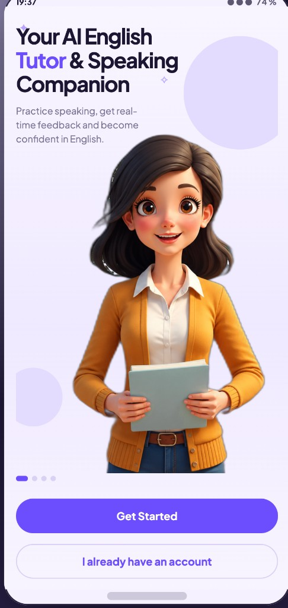
  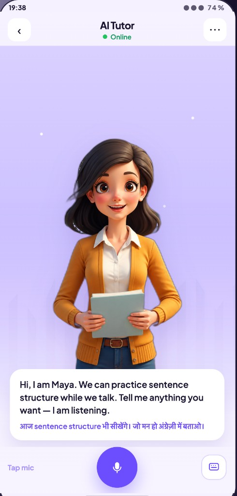
  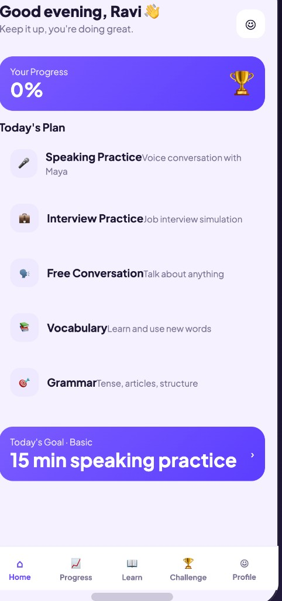
</p>

---

## What it is

Most English apps drill vocabulary. This one is a **speaking companion**. You talk to Maya the way you would talk to a tutor: introduce yourself, practice an interview, or just chat. She replies out loud, follows what you actually said, and shows a correction when your English is off — with a short Hindi line so the fix is easy to understand.

Built for learners who can study English but freeze when they have to speak: interviews, meetings, travel, and daily conversation.

---

## Product walkthrough

### Get started

OTP login (demo code `123456`), then set your level and daily goal.

<p align="center">
  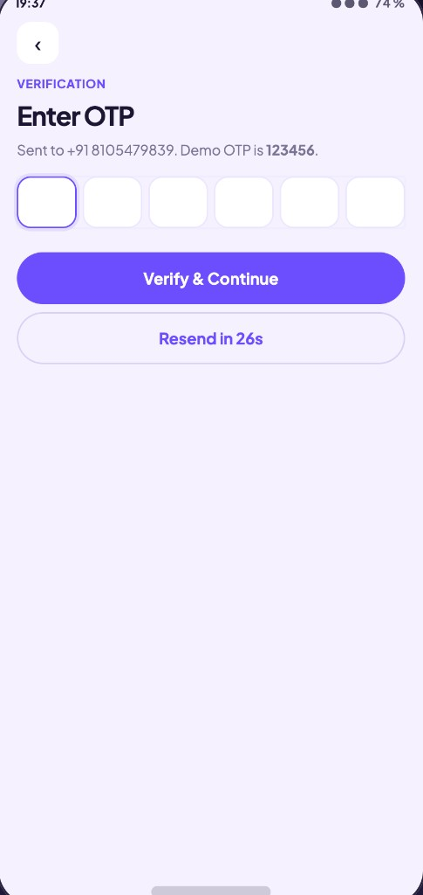
  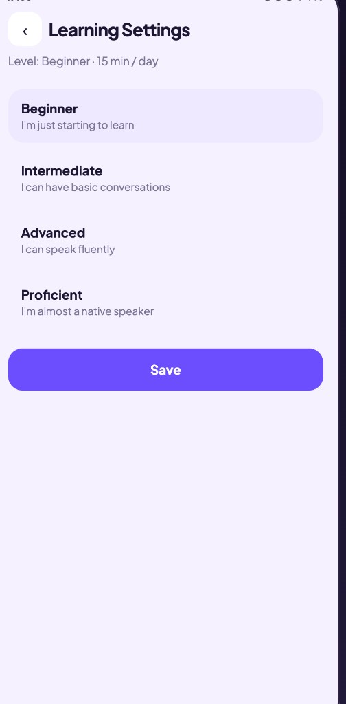
</p>

### Home — today's plan

A personalized dashboard with speaking practice, interview simulation, free conversation, vocabulary, and grammar. Daily goal sits at the bottom so the next session is one tap.

<p align="center">
  
</p>

| Plan | What you practice |
| --- | --- |
| Speaking Practice | Voice conversation with Maya |
| Interview Practice | Job interview simulation |
| Free Conversation | Talk about anything |
| Vocabulary | Learn and use new words |
| Grammar | Tense, articles, sentence structure |

### Talk with Maya

Tap the mic to speak, or switch to the keyboard. Maya greets you in English and Hindi, stays online for the session, and coaches in the same turn — for example, when you say *I am*, she can nudge you toward the more natural *I'm*.

<p align="center">
  
  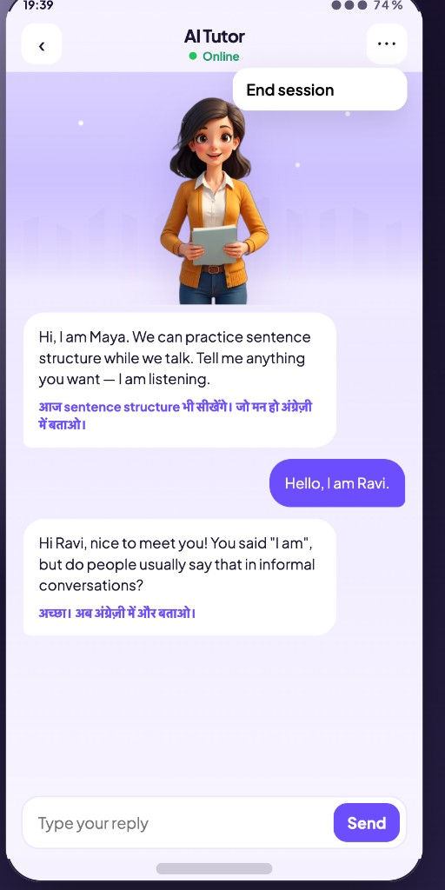
</p>

### Progress, words, and a daily challenge

After sessions you see CEFR-style level progress (B1 → B2), skill bars for speaking, grammar, vocabulary, and pronunciation, plus streak and conversation count. Learn has a word of the day with IPA and playback. Challenge is a 2-minute speaking task Maya scores for fluency and grammar.

<p align="center">
  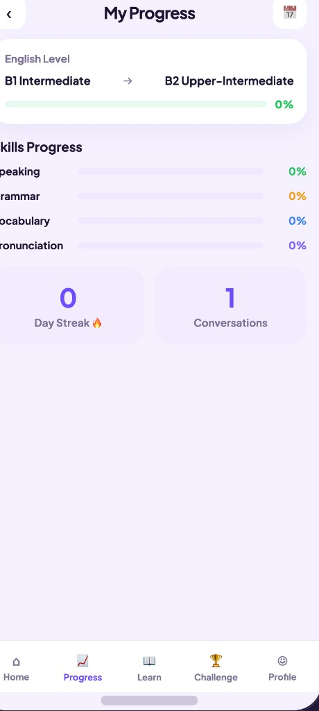
  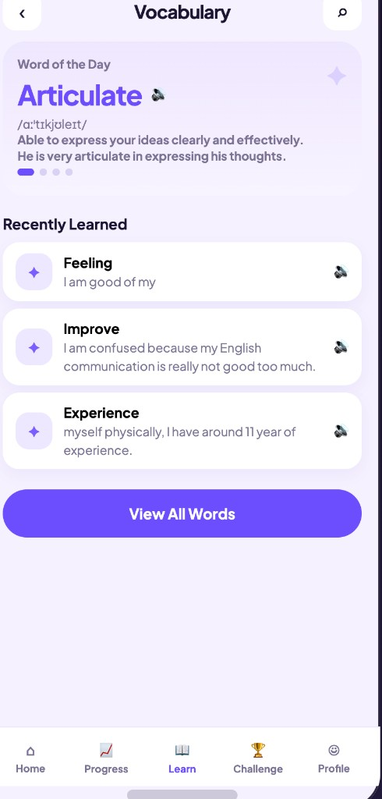
  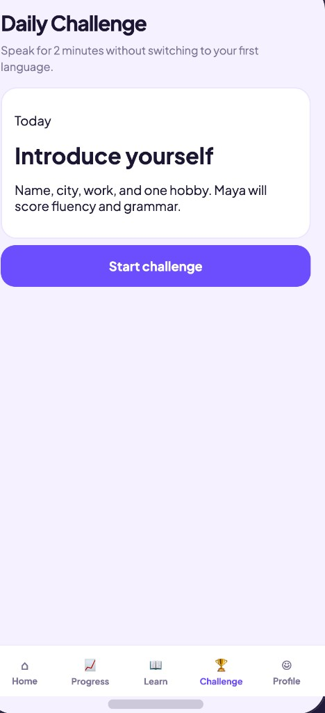
</p>

### Profile and plans

Account, learning settings, help, and invite a friend. Freemium billing in INR: **Basic** (₹0, 5 conversations / day) and **Premium** (₹299 / month, unlimited conversations, advanced feedback, vocabulary builder, grammar tips). Yearly saves 20%.

<p align="center">
  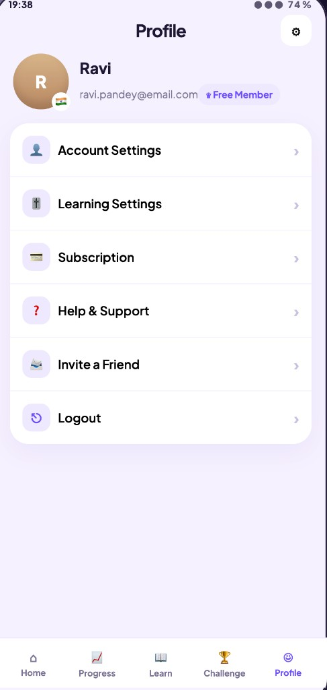
  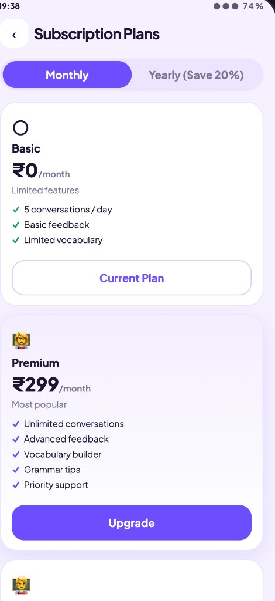
</p>

---

## How a session works

1. You speak or type.
2. Speech is transcribed.
3. A grammar pass finds what to fix — separately from the spoken reply, so Maya does not lecture mid-sentence.
4. The tutor reacts to *your last words* and asks one new follow-up. It does not recycle “What did you do today?”
5. Maya speaks the reply (TTS). Hindi appears under the English line when a correction or prompt helps.
6. Scores and words are stored so Progress and Learn stay in sync.

---

## Run locally

**Needs:** Python 3.9+, [Ollama](https://ollama.com) with `llama3.2`, and a microphone for voice.

```bash
# from the project root (parent of this package)
python3 -m venv .venv
source .venv/bin/activate
pip install -r requirements.txt

ollama pull llama3.2

python main.py
```

Open **http://127.0.0.1:7860**

- Sign in with any 10-digit Indian number. Demo OTP is **123456**.
- Allow the microphone when you start a speaking session.
- CLI mic loop instead of the app: `python main.py --cli`

Optional env (see `config.py`): `OLLAMA_BASE_URL`, `OLLAMA_MODEL`, `TTS_VOICE`, `LANGUAGE`.

Frontend is `lumen-web` (React + Vite). Production build is served from `lumen-web/dist`. To rebuild the UI:

```bash
cd lumen-web
npm install
npm run build
```

---

## Stack

| Layer | Choice |
| --- | --- |
| App UI | React, Vite — mobile-first Android-style shell |
| API | FastAPI + WebSocket (`/ws/tutor`) |
| Conversation + grammar | Local LLM via Ollama (`llama3.2`) |
| Speech in | Browser capture → STT |
| Speech out | edge-tts (Maya / Noah / Priya voices) |
| Progress | SQLite (`sessions`, `turns`, skill scores) |

Tutors: **Maya** (warm conversation), **Noah** (pronunciation), **Priya** (patient grammar). Modes include free talk, interview, workplace, travel, restaurant, meetings, grammar, vocabulary, and pronunciation.

---

## Why this product

People around us can *read* English and still freeze when they have to *speak*. Paid tutors are expensive. Chatbots feel like quizzes. This app owns that gap: a voice loop that sounds like a person, coaches without embarrassing you, and tracks the skills that actually matter — speaking, grammar, vocabulary, and pronunciation.
